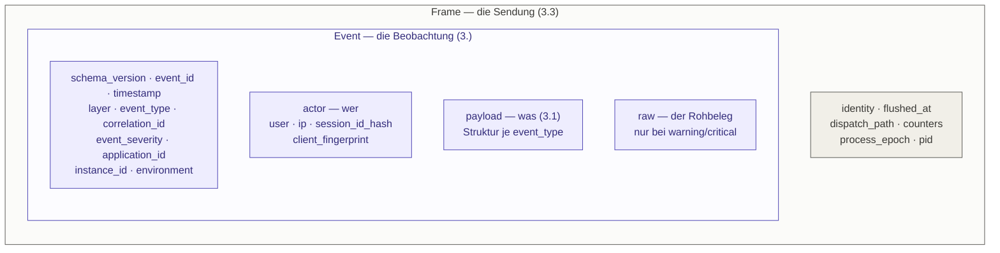

# projektmotor/ids-event-data

Das Drahtformat der IDS-Ereignisse: Feldnamen, geschlossene Wertelisten, Value Objects
und der Transport-Umschlag. Reines PHP, kein Framework, keine Laufzeitabhängigkeit außer
`ext-mbstring`.

**Das Format ist die Paketgrenze.** Sensor und Collector kennen voneinander nichts außer
dem JSON, das dieses Paket beschreibt — keine gemeinsame Bibliothek, keine
PHP-Serialisierung, keine Klassennamen auf der Leitung. Dieses Paket ist die
gemeinsame Lesart davon.

| Konsument | Rolle |
|---|---|
| [`projektmotor/ids-sensor-bundle`](https://github.com/projektmotor/ids-sensor-bundle) | erzeugt Events in diesem Format und versendet sie |
| `projektmotor/ids-backend-bundle` | empfängt sie und wertet sie aus |

Weil beide dasselbe Paket lesen, kann keiner der beiden das Format einseitig verschieben,
ohne dass es auffällt. Genau dafür existiert es — nicht wegen des Codes, der darin steht.

## Installation

```bash
composer require projektmotor/ids-event-data
```

```php
use ProjektMotor\IdsEventData\Vocabulary\Severity;

return Severity::Critical->value;   // 'critical'
```

## Drei Ebenen der Verschachtelung



Ein Frame umhüllt die Events eines Requests; ein Event trägt seinen Payload und optional
den Rohbeleg. Der Frame ist **kein** Event und ändert das Event-Schema nicht — deshalb
liegen `dispatch_path` und die Zählerstände dort und nicht im Event: sie sind
Eigenschaften der *Sendung*, nicht einer *Beobachtung*.

Die Verzeichnisse unter `src/` spiegeln genau diese Verschachtelung. Von oben nach unten
gelesen ist das das JSON von außen nach innen:

```
Frame/        Frame  DispatchPath              was auf der Leitung liegt
Event/        EventSchema  NormalizedEvent     was im Frame liegt
              Actor  SensorIdentity
Payload/      KernelPayload  SecurityPayload   was im Event liegt
Vocabulary/   Layer  Severity  Environment     die geschlossenen Wertelisten
```

Die Abhängigkeiten zeigen dabei nur nach unten: `Vocabulary/` und `Payload/` importieren
nichts, `Event/` liest aus `Vocabulary/`, `Frame/` aus `Event/`. Das prüft
`tests/Unit/ArchitectureTest.php` mit — ebenso wie die Zusage, dass keine Datei
irgendetwas Fremdes importiert.

## Ein Event, wie es ankommt

```json
{
  "schema_version": 1,
  "event_id": "b3f1e6b0-6e3a-4c9a-9f2e-2a6a2f4b9c11",
  "timestamp": "2026-08-13T10:15:32.421Z",
  "layer": "kernel",
  "event_type": "kernel.exception",
  "correlation_id": "req-7f2a1c",
  "event_severity": "warning",
  "application_id": "shop-api",
  "instance_id": "web-03",
  "environment": "prod",
  "actor": {
    "user": null,
    "ip": "203.0.113.42",
    "session_id_hash": "a3f9c1d8e4b27a05",
    "client_fingerprint": "c71b04ae9f3d62"
  },
  "payload": {
    "exception_class": "Symfony\\Component\\HttpKernel\\Exception\\NotFoundHttpException",
    "exception_message": "No route found for GET /wp-admin/setup-config.php",
    "http_status": 404
  }
}
```

Die zwölf Felder in `EventSchema::MANDATORY_FIELDS` sowie die vier `actor.*`-Felder sind
**Pflicht** — immer vorhanden, unabhängig von der Ebene. Die `actor.*`-Felder sind dabei
ausdrücklich *nullable*: bei `kernel.request` liegt meist noch kein Security-Token vor,
bei zustandslosen API-Requests existiert keine Session, im CLI-Kontext kein HTTP-Kontext.

## Die geschlossenen Wertelisten

Drei Felder haben eine feste, endliche Wertemenge. Sie entsprechen exakt den ENUM-Typen
im Datenbankschema des Collectors — **ein neuer Fall ist dort eine Migration auf der
Gegenseite**, nicht ein lokales Hinzufügen.

| Feld | Werte | Klasse |
|---|---|---|
| `layer` | `kernel` · `security` · `business` | `Vocabulary\Layer` |
| `event_severity` | `info` · `warning` · `critical` | `Vocabulary\Severity` |
| `environment` | `prod` · `staging` · `dev` | `Vocabulary\Environment` |

`environment` ist der Wert, den man am leichtesten falsch setzt und dessen Fehler völlig
lautlos bleibt: kommt beim Collector etwas anderes als diese drei an, scheitert das
Einfügen — stiller Totalverlust dieser Instanz, von einem stillgelegten Sensor nicht zu
unterscheiden. `%kernel.environment%` darf deshalb nicht durchgereicht werden; die
Übersetzung übernimmt sensorseitig der `EnvironmentResolver`.

`Severity` trägt zusätzlich zwei Prädikate, weil an ihnen Politik hängt und nicht nur
ein Wert:

| Methode | wahr für | wozu |
|---|---|---|
| `carriesRaw()` | `warning`, `critical` | ob das `raw`-Feld überhaupt übertragen wird |
| `isSampleable()` | `info` | ob das Event weggesampelt werden darf |

## Der Payload je Ebene

Der variable Teil. Immer ein flaches oder maximal zweistufig verschachteltes Objekt.

| `layer` | Feldnamen definiert in | Beispiele |
|---|---|---|
| `kernel` | `Payload\KernelPayload` | `method`, `path`, `route`, `http_status`, `exception_class` |
| `security` | `Payload\SecurityPayload` | `firewall`, `authenticator`, `attribute`, `resource`, `decision` |
| `business` | — | frei; die Anwendung liefert ihn selbst |

Für die Business-Ebene gibt es bewusst **keine** feste Struktur — was ein Vorfall
bedeutet, weiß nur die Anwendung.

## Das `raw`-Feld

`raw` trägt den unverarbeiteten Rohbeleg und ist **kein Pflichtfeld**. Es wird nur für
`warning` und `critical` übertragen, weil es über 95 % des Datenvolumens ausmacht und die
Masse aller Events `info` ist.

Deshalb hält `NormalizedEvent` es als `\Closure` und wertet sie erst in `toArray()` aus —
und auch dort nur, wenn die Severity das Feld überhaupt trägt. Der `info`-Pfad zahlt für
Header-Kopien und Redaktion damit nichts. Was der Rohbeleg enthält und was darin
unkenntlich gemacht wird, entscheidet der Konsument; dieses Paket legt nur fest, wann das
Feld auf der Leitung erscheint.

## Was am Format verbindlich ist

`schema_version` ist **nicht konfigurierbar**. Der Sensor sendet genau eine Version. Wäre
sie einstellbar, könnte eine kompromittierte Anwendung eine alte Version behaupten und
damit collectorseitig den nachsichtigen Pfad auslösen.

Die Bump-Regeln:

- **kein** Bump bei additiven, optionalen Feldern — der Collector ignoriert Unbekanntes
- **Bump** beim Entfernen, Umbenennen oder Umtypisieren eines Pflichtfeldes, bei
  geänderter Bedeutung eines Feldes oder geändertem Hash-Verfahren

Der Zeitstempel ist auf `Y-m-d\TH:i:s.v\Z` festgelegt — UTC, Millisekunden, literales `Z`.
Das `Z` ist dabei **literal** und keine Zeitzonenangabe: wer einen Zeitpunkt in einer
anderen Zone formatiert, muss ihn vorher umrechnen, sonst ist die Beschriftung falsch.

## Öffentliche API

Semantic Versioning gilt für **das gesamte Paket**. Es gibt hier nichts Internes: jede
Konstante, jeder Enum-Wert und jeder Feldname in `toArray()` ist Vertragstext, auf den
sich die Gegenseite verlässt. `tests/Unit/ArchitectureTest::testNothingIsInternal()` hält
das fest.

Änderungen stehen in [CHANGELOG.md](CHANGELOG.md).

## Entwicklung

Keine Infrastruktur nötig — das Paket hat weder Container noch Broker noch Datenbank:

```bash
composer install
vendor/bin/phpunit                              # Tests
vendor/bin/phpstan analyse                      # statische Analyse, Level 9
vendor/bin/php-cs-fixer fix --dry-run --diff    # Coding Standards
```

Die Probe, an der alles hängt — das Paket darf nichts Fremdes kennen:

```bash
grep -rEn 'Symfony\\|Psr\\' src/ ; echo "exit=$?"   # erwartet: keine Treffer, exit=1
```

## Lizenz

MIT — siehe [LICENSE](LICENSE).
